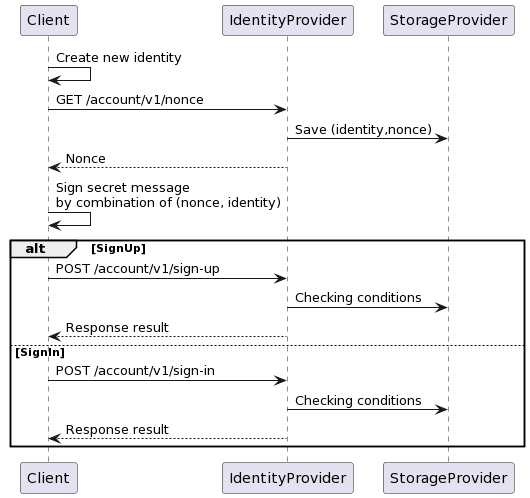

- [Introduction](#primary-key-accounts)
- [Background](#background)
- [Authentication using ECDSA](#authentication-using-ecdsa)
    - [1. Create an identity](#1-create-an-identity)
    - [2. Create a nonce](#2-create-a-nonce)
    - [3. Sign nonce with private key](#3-sign-nonce-with-private-key)
    - [4. Authenticate using signed message](#4-authentication-using-signed-message)
        - [4.1 Sign-up](#41-sign-up)
        - [4.2 Sign-in](#42-sign-in)

# Primary Key accounts
Primary Key accounts are one of Nunchuk's authentication mechanisms. It uses one of your Bitcoin public-private key pairs to replace the usual username/password for logging in.

# Background
Email logins have been highly useful as part of an overall Internet architecture for various reasons:
- Email accounts allow easy correspondence between the users and the service provider, including critical security updates.
- Certain types of content and services are better served using email.
- Emails represent digital capital (a form of Proof-of-Work) and can act as a natural 2FA against hacking and spamming.

Nevertheless, email address data have been frequently targeted, leaked and exploited over the years, especially when service providers have little to no security systems in place.

Primary Key accounts are our solution to that. It uses public-key cryptography and leverages Bitcoin's native ECDSA protocol (it can be updated to Schnorr later) to provide an alternative authentication mechanism.

If you have any feedback or questions, please email support@nunchuk.io or join our Slack.

# Authentication using ECDSA



## 1. Create an identity

    # We use bitcoin-cli here, but feel free to use any other tools
    > bitcoin-cli getnewaddress
    
    < 1HZwkjkeaoZfTSaJxDw6aKkxp45agDiEzN

## 2. Create a nonce

    # identity = hash(public_key). In case of bitcoin-cli, we use the address, which was already hashed.
    # username is an alias to identity
    > GET /account/v1/nonce?identity=${identity}&username=${username}

    < {"nonce":"thisisanonce"}

## 3. Sign nonce with private key

    # We use bitcoin-cli here, but feel free to use any other tools
    # message should be the combination of username and nonce. eg: ${username}${nonce}
    > bitcoin-cli signmessage "${identity}" "${message}"

## 4. Authentication using signed message

### 4.1 Sign-up

    > POST /account/v1/sign-up
    {
        "identity": "${identity}",
        "username": "${username}",
        "nonce": "${nonce}",
        "signature": "${signature}"
    }

    # Response really depends on the server implementation. But usually, it includes an access_token, token type and expiration time.
    < {"access_token": "thisisanaccess_token", "token_type": "Bearer", "expires_in": 3600}

### 4.2 Sign-in

1. Server looks up where (identity, username) is located in the database
2. Verify the signature

   ```
   > POST /account/v1/sign-up
   {
       "identity": "${identity}",
       "username": "${username}",
       "nonce": "${nonce}",
       "signature": "${signature}"
   }

   # Response really depends on the server implementation. But usually, it includes an access_token, token type and expiration time.
   < {"access_token": "thisisanaccess_token", "token_type": "Bearer", "expires_in": 3600}
   ```   
